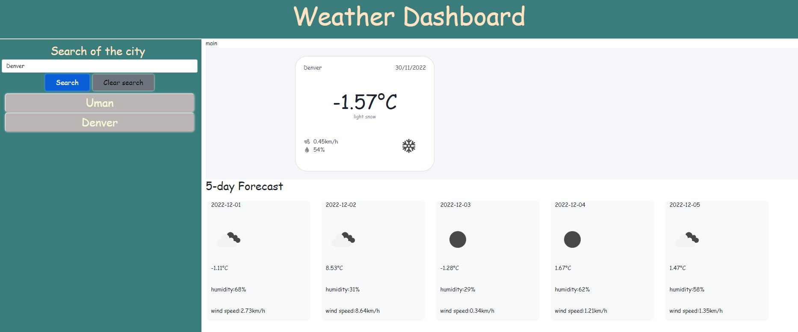

# Weather dashboard
## Project description
 The app provides a user with current weather info and five day forcast.
 Using input form a user can get weather condition for the chosen city. After pushing search button  the User will be presented with current weaather conditions and 5 day forcast.
 History of the search  will be saved and displayed below for further usage. User has to press a buton from history section and will be  presented with weather conditions.

github repo : https://github.com/felixbor/Felix-weather-forecaster
page : https://felixbor.github.io/Felix-weather-forecaster/
 
